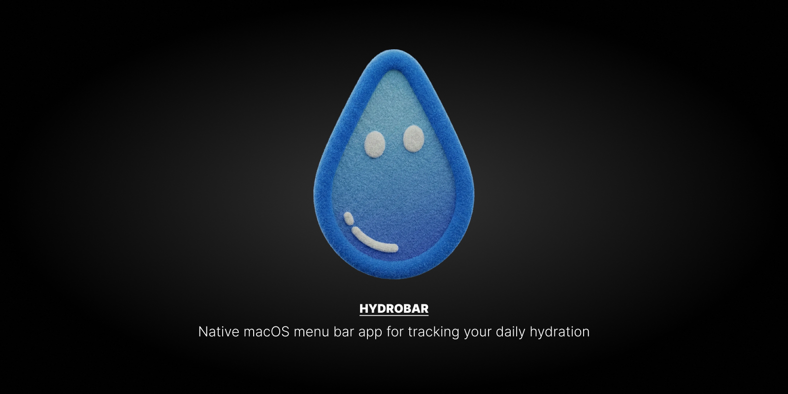
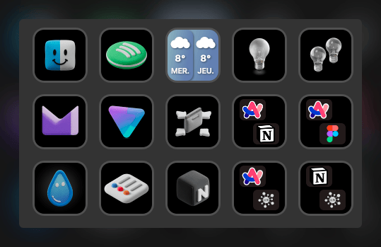
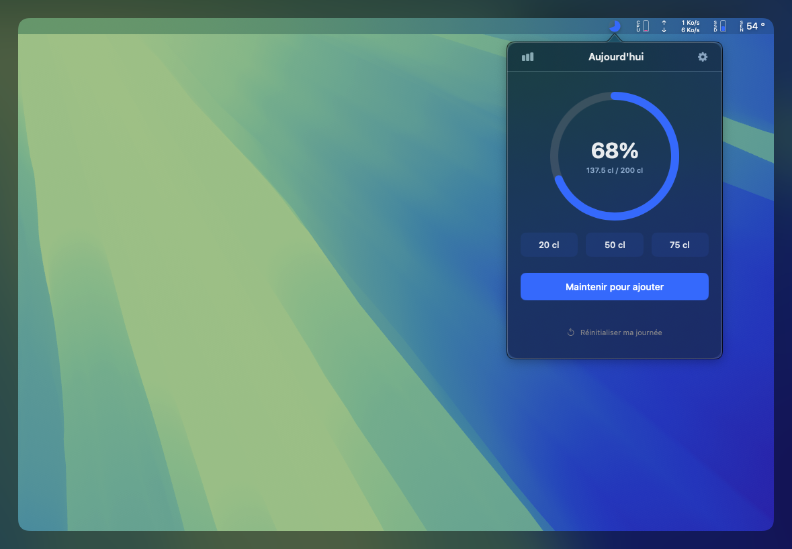
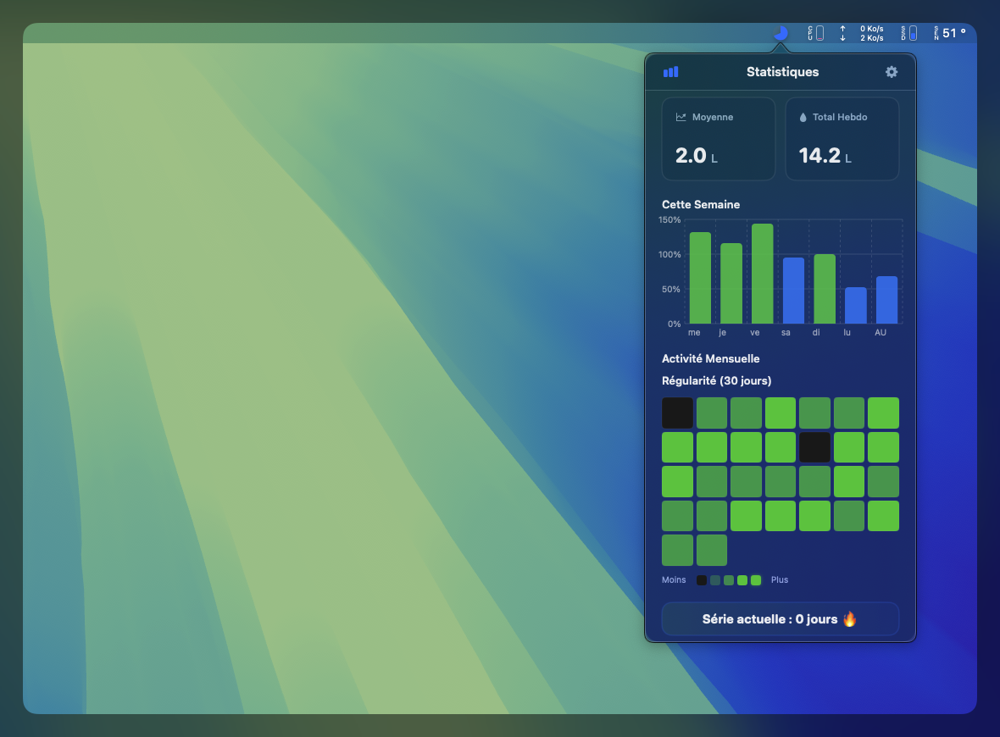
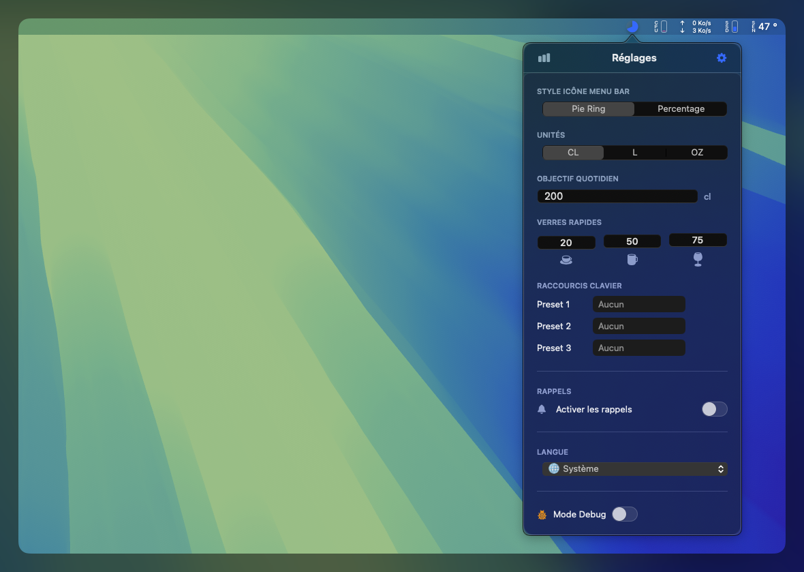
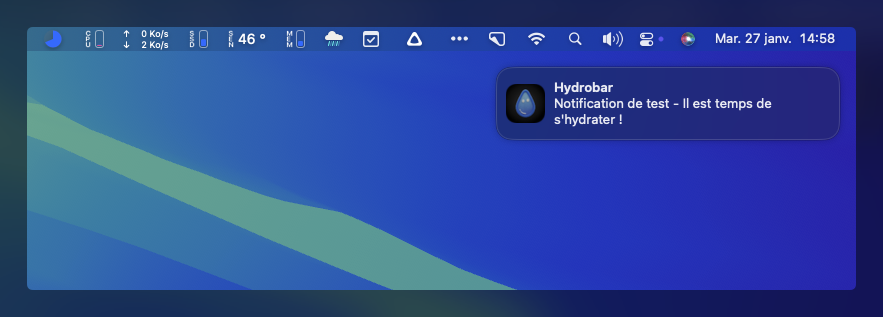

<div align="center">

# 💧 HYDROBAR


**Native macOS menu bar app for tracking your daily hydration**

[Features](#-features) • [Installation](#-installation) • [Usage](#-usage) • [Building](#-building-from-source)



</div>

---

## ✨ About

HydroBar is a native macOS application that helps you stay hydrated throughout the day. Running discreetly in your menu bar, it tracks your water intake, sends reminders, and provides detailed statistics to help you maintain healthy hydration habits.

Built with SwiftUI and following Apple's Human Interface Guidelines, HydroBar offers a smooth, intuitive experience that feels native to macOS.

---

## 🎯 Features

### 💧 Daily Hydration Tracking
- **Real-time progress ring** with animated visual feedback
- **Customizable daily goal** (ml, cl, oz, fl oz)
- **Quick preset buttons** for common water amounts
- **Hold-to-Add mode** for continuous water intake
- **Automatic daily reset** at midnight

### 📊 Advanced Statistics
- **Weekly bar chart** showing your progress over the last 7 days
- **30-day heatmap** visualizing your consistency (hover any day to see date and amount, like GitHub’s contribution graph)
- **Key metrics**: daily average, weekly total, current streak
- **Color-coded indicators** (green for goal achieved, blue for in progress)

### 🔔 Smart Notifications
- **Customizable reminder intervals** (15min to 4 hours)
- **Focus Mode integration**: automatically respects macOS Do Not Disturb
- **Visual badge** in menu bar when reminders are active
- **Quick action buttons** in notifications to add water instantly

### ⌨️ Global Keyboard Shortcuts
- **Custom shortcuts** for each preset amount
- **System-wide functionality**: works from any application
- **Intuitive recorder interface** to set your preferred shortcuts
- **Accessibility permission** required (one-time setup)
- **Stream Deck compatible**: Use your configured shortcuts with Elgato Stream Deck for one-click hydration tracking

<div align="center">



*Configure your Stream Deck buttons to trigger HydroBar shortcuts for instant water intake logging with a single press.*

</div>

### 🎨 Modern Interface
- **Clean, minimal design** following macOS design principles
- **Adaptive dark/light mode** matching system preferences
- **Smooth animations** and transitions
- **Customizable menu bar icon**: choose between progress ring or percentage display

### 🌍 Multi-language Support
- **9 languages available**:
  - 🇬🇧 English
  - 🇫🇷 French
  - 🇪🇸 Spanish
  - 🇩🇪 German
  - 🇮🇹 Italian
  - 🇵🇹 Portuguese
  - 🇳🇱 Dutch
  - 🇯🇵 Japanese
  - 🇨🇳 Simplified Chinese
- **Automatic language detection** based on system settings
- **Manual language selection** available in settings

### 🔄 Additional Features
- **Check for updates** in Settings: compares with [GitHub Releases](https://github.com/aedhx/HydroBar/releases) and notifies when a new version is available
- **Undo/Redo support** (Cmd+Z) to correct mistakes
- **Complete history** saved locally on your Mac
- **Data persistence** across app restarts and updates
- **Privacy-first**: all data stays on your device, no cloud sync (only optional outbound request to GitHub API for update check)

---

## 🚀 Installation

### Method 1: Direct Download (Recommended)

1. Download `HydroBar-v1.1.dmg` from the [Releases](https://github.com/aedhx/HydroBar/releases) page
2. Double-click the DMG file to mount it
3. Drag `HydroBar.app` to your Applications folder
4. Open Applications and launch HydroBar
5. **First launch**: Right-click on the app > **Open** (required to bypass Gatekeeper security)
6. Click **"Open"** in the security dialog

### Required Permissions

After first launch, grant the following permissions in System Preferences:

- **Notifications**: System Preferences > Notifications > Enable for HydroBar
- **Accessibility**: System Preferences > Security & Privacy > Privacy > Accessibility > Add HydroBar
  - Required for global keyboard shortcuts to work

### Method 2: Build from Source

```bash
# Clone the repository
git clone https://github.com/aedhx/HydroBar.git
cd HydroBar/src/HydroBar

# Open in Xcode
open HydroBar.xcodeproj

# Build and run (Cmd+R in Xcode)
```

**Requirements:**
- macOS 12.0 (Monterey) or later
- Xcode 14.0 or later
- Swift 5.0+

---

## 📸 Screenshots

### Main View
The main interface displays your daily hydration progress with an animated circular progress ring showing your current percentage (68% in this example), quick preset buttons (20cl, 50cl, 75cl), and a Hold-to-Add feature for continuous water intake. The interface shows your current intake (137.5 cl) versus your daily goal (200 cl).



### Statistics
View your hydration data with a weekly bar chart showing your progress over 7 days, and a 30-day heatmap visualizing your consistency. Key metrics include daily average (2.0 L) and weekly totals (14.2 L). The chart uses color coding: green bars indicate goal achievement, blue bars show progress.



### Settings
Customize your experience: set daily goals, choose units (ml, cl, L, oz), configure menu bar icon style (Pie Ring or Percentage), set up notifications, assign keyboard shortcuts, **check for updates** (compares with GitHub Releases), and select your preferred language. The settings interface is clean and organized, making it easy to personalize your hydration tracking.



### Notifications
Smart reminders with customizable intervals. Notifications integrate seamlessly with macOS and respect your Focus Mode settings. The notification displays the app icon and a friendly reminder message to stay hydrated.



---

## 📖 Usage

### Getting Started

1. **Set your daily goal**: Open HydroBar from the menu bar and adjust your target in Settings
2. **Choose your unit**: Select ml, cl, L, oz, or fl oz
3. **Add water**: Click preset buttons or use the Hold-to-Add feature
4. **Enable reminders**: Configure notification intervals in Settings
5. **Set shortcuts** (optional): Record global keyboard shortcuts for quick water intake

### Menu Bar Icon

- **Click** the icon to open the main popover
- **Right-click** for the context menu:
  - **Version** at the top (current app version)
  - **Add 25cl / 250ml** quick action
  - **Keyboard Shortcuts** submenu: view configured shortcuts for each preset
  - **About** (version and credits)
  - **View Repository** (open GitHub sources)
  - **Quit**
- **Icon styles**: Progress ring (default) or percentage display
- **Badge indicator**: Red dot appears when reminders are active

### Statistics View

Access detailed statistics by clicking the chart icon in the main view:
- **Weekly chart**: Bar graph showing daily progress
- **Monthly heatmap**: Color-coded grid showing 30-day consistency; **hover any day** to see a tooltip with the date and hydration amount (or “No activity”)
- **Key metrics**: Average daily intake and weekly totals

---

## 🛠️ Building from Source

### Prerequisites

- macOS 12.0+ (Monterey or later)
- Xcode 14.0+
- Command Line Tools

### Build Steps

1. Clone the repository:
   ```bash
   git clone https://github.com/aedhx/HydroBar.git
   cd HydroBar/src/HydroBar
   ```

2. Open the project in Xcode:
   ```bash
   open HydroBar.xcodeproj
   ```

3. Select the `HydroBar` scheme and build (Cmd+B) or run (Cmd+R)

### Repository Structure

The repository contains only the essential files:

```
HydroBar/
├── src/
│   └── HydroBar/
│       ├── HydroBar/                    # Source code
│       │   ├── *.swift                  # Swift source files
│       │   ├── Assets.xcassets/         # App icons and assets
│       │   └── Localizable.xcstrings    # Localization (9 languages)
│       ├── HydroBar.xcodeproj/          # Xcode project
│       └── HydroBarTests/               # Unit tests
├── Resources/                            # Assets for distribution
│   ├── HydroBar-icon.png                # Application icon
│   └── DMG-background.png               # DMG background image
└── README.md                             # This file
```

**Note:** Build scripts and additional documentation have been removed to keep the repository minimal and focused on the source code.

---

## 🏗️ Architecture

HydroBar follows the **MVVM (Model-View-ViewModel)** pattern:

- **Model**: `HydrationManager` - Core data logic and state management
- **View**: SwiftUI views (`MainView`, `SettingsView`, `StatisticsView`)
- **ViewModel**: `HydrationManager` as `ObservableObject` binding views to data

### Key Components

- `HydrationManager.swift`: Core business logic, persistence, history management (MVVM ViewModel)
- `HydroBarApp.swift`: App lifecycle, menu bar setup, context menu, notifications
- `MainView.swift`: Main interface with progress ring and quick actions
- `SettingsView.swift`: Configuration, preferences, and update check (UPDATES section)
- `StatisticsView.swift`: Weekly and monthly statistics visualization
- `StatsComponents.swift`: Heatmap with hover tooltips, KPI cards, weekly chart
- `GitHubUpdateChecker.swift`: Check for new releases via GitHub API
- `GlobalHotkeyManager.swift`: System-wide keyboard shortcut handling
- `FocusModeMonitor.swift`: macOS Focus Mode integration
- `Localizable.xcstrings`: Multi-language support (9 languages)

---

## 🔒 Privacy & Security

- ✅ **100% local storage**: All data stays on your Mac
- ✅ **Optional network use**: Only for “Check for updates” in Settings (GitHub API, no tracking)
- ✅ **No tracking or analytics**
- ✅ **Open source**: Code is publicly available for review
- ✅ **No data collection**: We don't collect any personal information

### Gatekeeper Notice

HydroBar is not signed with an Apple Developer certificate (which requires a paid account). On first launch, macOS will show a security warning. This is normal for open-source applications. Simply right-click > Open to proceed.

---

## 🐛 Troubleshooting

### App won't open
- Right-click the app > Open (first launch only)
- Check System Preferences > Security & Privacy > General for "Open Anyway" option

### Notifications not working
- Enable notifications in System Preferences > Notifications
- Check that Do Not Disturb mode is not enabled
- Verify notification settings in HydroBar Settings

### Keyboard shortcuts not working
- Grant Accessibility permission: System Preferences > Security & Privacy > Privacy > Accessibility
- Restart the app after granting permission
- Verify shortcuts are configured in Settings

### Icon not visible in menu bar
- Check that the app is running (Activity Monitor)
- On Retina displays, the icon may appear very small
- Try restarting the app

---

## 📝 Requirements

- **macOS**: 12.0 (Monterey) or later
- **Architecture**: Universal (Intel and Apple Silicon)
- **Disk space**: ~15-20 MB
- **Permissions**: Notifications, Accessibility (for shortcuts)

---

## 🛣️ Roadmap

Future improvements planned:
- [ ] Data export functionality
- [ ] iCloud sync (optional)
- [ ] Widget support
- [ ] Health app integration
- [ ] Custom preset amounts
- [ ] Advanced statistics filters

---

## 📄 License

This project is licensed under the MIT License - see the LICENSE file for details.

---

## 👨‍💻 Developer

**Antoine Deshoux**
- 🌐 Website: [https://adx.cool/](https://adx.cool/)
- 💼 LinkedIn: [https://www.linkedin.com/in/deshouxantoine/](https://www.linkedin.com/in/deshouxantoine/)

---

## 🤝 Contributing

Contributions are welcome! Please feel free to submit a Pull Request. For major changes, please open an issue first to discuss what you would like to change.

1. Fork the repository
2. Create your feature branch (`git checkout -b feature/AmazingFeature`)
3. Commit your changes (`git commit -m 'Add some AmazingFeature'`)
4. Push to the branch (`git push origin feature/AmazingFeature`)
5. Open a Pull Request

---

## 📬 Support

- 🐛 **Bug reports**: [Open an issue](https://github.com/aedhx/HydroBar/issues)
- 💡 **Feature requests**: [Open an issue](https://github.com/aedhx/HydroBar/issues)
- ❓ **Questions**: Check existing issues or open a new one

---

<div align="center">

Made with ❤️ for macOS users

</div>
